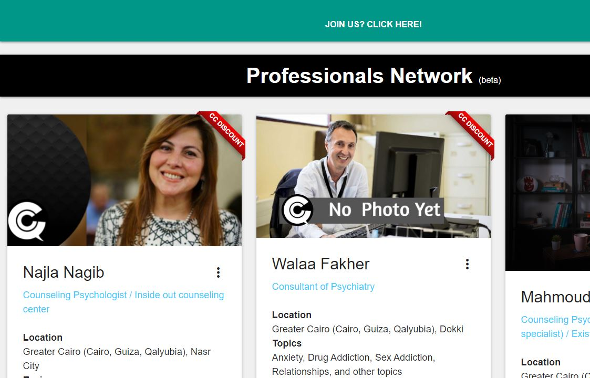

# CC-Professionals-Network-App

A Responsive Fullstack WebApp deployed through Google Apps Script as a public WebApp, listing professionals in Mental Health from which a requester and choose and contact.

Check the website [Here](https://script.google.com/macros/s/AKfycbyolMW42bCs6QbnPxUXIjbPr_FBxQDn0tk3xdt1D7L20M88fG0TkC5gNpGlclc1txM93g/exec)




## Table of Contents

* [Technologies](#technologies)
* [Installation](#installation)
* [Features](#features)
* [Questions](#questions)


## Technologies 

* Google Apps Script
* JavaScript ES6
* HTML5
* CSS3
* JSON
* clasp

## Installation

To install this application, in VS code after cloning the repo, use [clasp CLI](https://developers.google.com/apps-script/guides/clasp) to create the .clasp.json file

```
clasp create [scriptTitle]
```

Then add the destination script id to the .clasp.json file and then push the code using the following command

```
clasp push
```

To deploy the webapp, go to the deploy menu at the top, and select new deployment, then after the link appears

## Features

* Uses a basic MVC model, prerenders the view at database update to fetch the ready rendred full view when the WebApp loads
* Relies on JSON files as a minor DB for the professionals
* Admin side and dashboard on Google Sheets that controls and edits cards and info of professionals
* Automated Emails sent to professionals and requesters as a request gets placed


## Questions 

If you have any more questions, please contact me here:

Github Username: [mohamedallam13](https://mohamedallam13.github.io/react-professional-portfolio/)

Email: [mohamedallam.tu@gmail.com](mailto:mohamedallam.tu@gmail.com)
